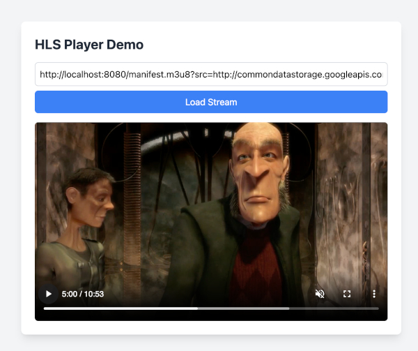

# Streamabol

Streamabol is a lightweight Golang application that converts video files into HLS (HTTP Live Streaming) streams on the fly. It takes a video URL as input and generates an HLS-compliant manifest (`.m3u8`) along with segmented video streams, making it ideal for real-time video streaming applications.



## Quickstart

To quickly get started with Streamabol, you can use the prebuilt Docker image:

```bash
docker run -it --rm --name=streamabol -p 8080:8080 runabol/streamabol
```

Play a sample HLS stream: 

```bash
https://hls-player-demo.vercel.app/?src=http://localhost:8080/manifest.m3u8?src=http://commondatastorage.googleapis.com/gtv-videos-bucket/sample/ElephantsDream.mp4
```

## Features
- Converts video files to HLS streams dynamically
- Supports remote video URLs as input
- Simple HTTP API for generating HLS manifests
- Lightweight and efficient, built with Go

## Prerequisites
- [FFmpeg](https://ffmpeg.org/download.html) installed on your system (used for video processing)

## Installation
1. Clone the repository:
   ```bash
   git clone https://github.com/runabol/streamabol.git
   ```
2. Navigate to the project directory:
   ```bash
   cd streamabol
   ```
3. Install dependencies:
   ```bash
   go mod tidy
   ```
4. Build the application:
   ```bash
   go build -o streamabol
   ```

## Usage
1. Start the server:
   ```bash
   ./streamabol
   ```
   The server will run on `http://localhost:8080` by default.

2. Request an HLS stream by providing a video URL:
   ```
   http://localhost:8080/manifest.m3u8?src=https://example.com/myvideo.mp4
   ```
   - `src`: The URL of the video file to convert (e.g., `.mp4`, `.mov`, etc.)
   - Response: An HLS manifest (`.m3u8`) with segmented streams generated on the fly.

3. Use the generated `.m3u8` URL in an HLS-compatible player (e.g., [HLS.js](https://hlsjs.video-dev.org/)).

## Example
```bash
curl "http://localhost:8080/manifest.m3u8?src=https://example.com/myvideo.mp4"
```
This will return an HLS manifest that points to the segmented video streams processed by Streamabol.

## License
This project is licensed under the MIT License. See the [LICENSE](LICENSE) file for details.
